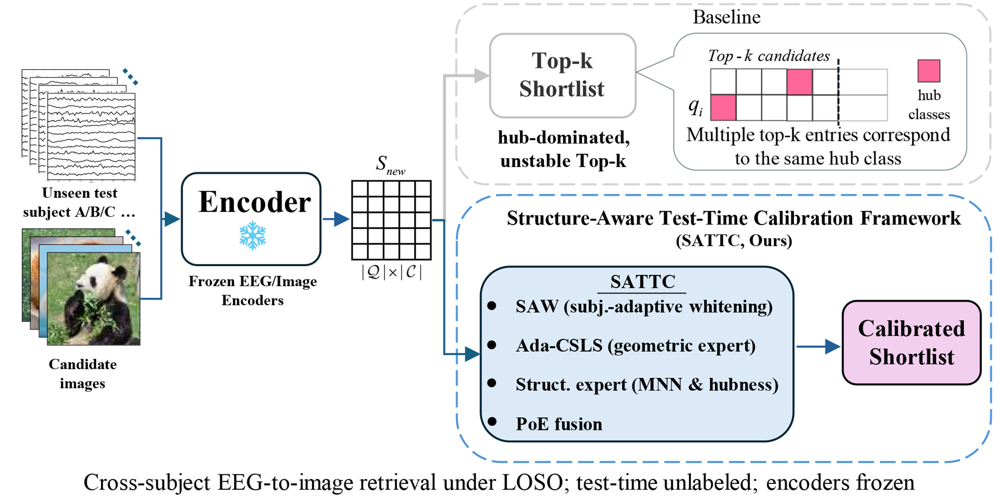

<h1 align="center">SATTC: Structure-Aware Label-Free Test-Time Calibration for Cross-Subject EEG-to-Image Retrieval</h1>

<p align="center">
  
  <a href="https://arxiv.org/abs/2603.20738"></a>
  <a href="./LICENSE"></a>

</p>

<p align="center">
  <a href="mailto:huangqunjie@stu.ynu.edu.cn">Qunjie Huang</a>
  ·
  <a href="mailto:zhuweina@ynu.edu.cn">Weina Zhu</a><sup>*</sup>
</p>

<p align="center">
  Yunnan University, China
</p>

<p align="center">
  <sup>*</sup> Corresponding author
</p>

---

## Abstract

Cross-subject EEG-to-image retrieval is challenged by **subject shift** and **hubness**, which distort similarity geometry and destabilize top-*k* rankings. We introduce **SATTC** (Structure-Aware Test-Time Calibration), a label-free framework that calibrates the similarity matrix of frozen EEG and image encoders at test time. SATTC combines a **geometric expert**—subject-adaptive whitening with adaptive CSLS—and a **structural expert** derived from mutual nearest neighbors, bidirectional top-*k* ranks, and class popularity, fused through a simple Product-of-Experts rule. Under strict leave-one-subject-out evaluation on **THINGS-EEG**, SATTC consistently improves Top-1/Top-5 retrieval, reduces hubness and class imbalance, and produces more reliable small-*k* shortlists across multiple EEG encoders.

<p align="center">
  
</p>

## News

- **[2026/03]** arXiv version available.
- **[2026/03]** Code released for SATTC.
- **[2026/03]** CVPR 2026 camera-ready submission completed. 


## Installation

### Requirements

- Python ≥ 3.10
- PyTorch ≥ 2.0 with CUDA support
- GPU: ≥ 16 GB VRAM recommended (paper experiments run on RTX 4090, 24 GB)
- **CPU RAM: ≥ 36 GB** — each training subject uses ~4.2 GB; full 9-subject LOSO requires ~38 GB at peak during dataset loading. Reduce the subject list (`--subjects`) if RAM is limited.
- See [`requirements.txt`](requirements.txt) for full list

### Quick Setup

```bash
# Option A: using the setup script (creates a conda env named 'sattc')
bash setup.sh

# Option B: manual install
conda create -n sattc python=3.10 -y
conda activate sattc
pip install torch torchvision --index-url https://download.pytorch.org/whl/cu118
pip install -r requirements.txt
```

## Data Preparation

We use the **THINGS-EEG** dataset. Download the preprocessed data from [OSF](https://osf.io/3jk45/) (Gifford et al.).

Organize the data as follows:

```
/path/to/THINGS-EEG/
├── Preprocessed_data_250Hz/
│   ├── sub-01/
│   │   ├── preprocessed_eeg_training.npy
│   │   └── preprocessed_eeg_test.npy
│   ├── sub-02/
│   └── ...
└── image_set/
    ├── training_images/
    └── test_images/
```

Update the paths in [`Retrieval/data_config.json`](Retrieval/data_config.json) to point to your local copy.

### EEG Preprocessing (Optional)

If you want to preprocess from raw EEG data:

```bash
cd EEG-preprocessing/
python preprocessing.py
```

## Usage

### EEG-to-Image Retrieval (Leave-One-Subject-Out)

Run the full LOSO evaluation with all SATTC components (SAW, CSLS, Ada-CSLS, PoE are **enabled by default**):

```bash
cd Retrieval/
python run_sattc_loso.py \
    --logger True \
    --gpu cuda:0 \
    --batch_size 1024 \
    --output_dir ./outputs/loso_sattc
```

This command runs the LOSO evaluation pipeline used in the paper under the default SATTC configuration. Full paper results are obtained by evaluating all held-out subjects and aggregating all folds. Each of `sub-01` – `sub-10` is held out as the test subject in turn, with the remaining 9 subjects used for training. Results are aggregated across all folds.

To ablate individual components:

```bash
# Disable SAW (Subject-Adaptive Whitening)
python run_sattc_loso.py --no_saw ...

# Disable CSLS / Ada-CSLS
python run_sattc_loso.py --no_csls ...

# Disable Product-of-Experts fusion
python run_sattc_loso.py --disable_poe ...
```

### Baseline Comparison (e.g., EEGNetV4)

```bash
cd Retrieval/
python contrast_retrieval.py \
    --encoder_type EEGNetv4_Encoder \
    --epochs 30 \
    --batch_size 1024
```

## Project Structure

```
SATTC-CVPR2026/
├── Retrieval/                    # Core retrieval pipeline
│   ├── run_sattc_loso.py         #   Main LOSO training & evaluation entry
│   ├── contrast_retrieval.py     #   Baseline encoder comparison
│   ├── eegdatasets_leaveone.py   #   LOSO dataset loader
│   ├── split_generator.py        #   Cross-validation split generator
│   ├── fold_aggregate.py         #   Fold-level result aggregation
│   ├── mnn_pre_check.py          #   MNN diagnostics (used by main pipeline)
│   ├── soft_mnn.py               #   Soft-MNN utilities
│   ├── loss.py                   #   Loss functions
│   ├── util.py                   #   General utilities
│   ├── data_config.json          #   Data path configuration
│   ├── subject_layers/           #   EEG encoder backbone modules
│   │   ├── Transformer_EncDec.py
│   │   ├── SelfAttention_Family.py
│   │   └── Embed.py
│   └── utils/                    #   CLI argument helpers
│       ├── cli_args.py
│       └── masking.py
├── EEG-preprocessing/            # Raw EEG preprocessing scripts
│   ├── preprocessing.py
│   └── preprocessing_utils.py
├── requirements.txt
├── setup.sh
├── LICENSE
└── README.md
```

## Citation

If you find this work useful, please cite:

```bibtex
@inproceedings{huang2026sattc,
  title     = {SATTC: Structure-Aware Label-Free Test-Time Calibration for Cross-Subject EEG-to-Image Retrieval},
  author    = {Huang, Qunjie and Zhu, Weina},
  booktitle = {Proceedings of the IEEE/CVF Conference on Computer Vision and Pattern Recognition},
  year      = {2026}
}
```

## Acknowledgments

We thank the authors of the following resources and prior works that supported this project:

- [Visual Decoding and Reconstruction via EEG Embeddings with Guided Diffusion](https://arxiv.org/abs/2403.07721) — Li et al., NeurIPS 2024
- [THINGS-EEG Dataset](https://www.sciencedirect.com/science/article/pii/S1053811922008758) — Gifford et al.
- [EEG Natural Image Decoding](https://arxiv.org/abs/2308.13234) — Song et al.

## License

This project is licensed under the [MIT License](LICENSE).
